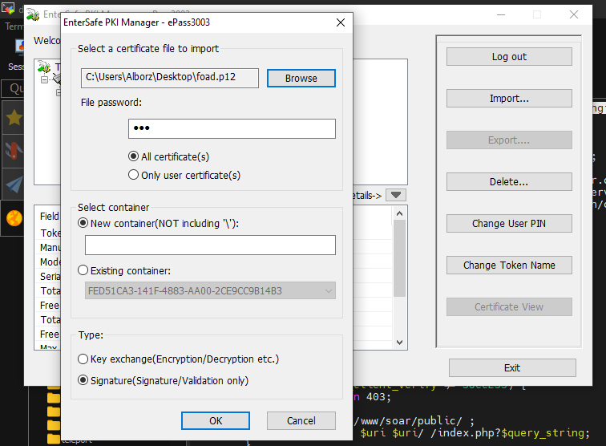
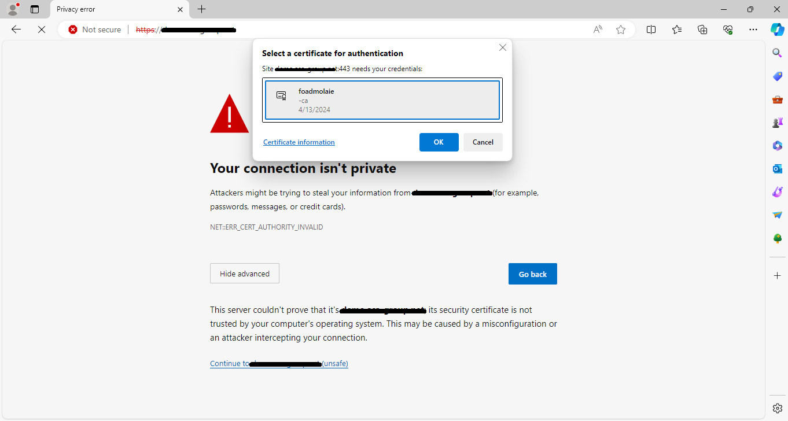

# nginx-certificate-auth
nginx certificate auth

# Step1: Create self-sign cert
```
git clone https://github.com/mmolaie/nginx-certificate-auth 

cd cert && chmod +x make.sh

./make.sh

openssl pkcs12 -export -out foad.p12 -inkey agent.key -in agent.crt -chain -CAfile ca.crt
```

# Step2: Change nginx conf
Set it to give a 403 response to unauth requests!
```
cp ./nginx/conf.d/base.conf /etc/nginx/conf.d

service nginx restart
```
# Step3: Import Cert to token





# lets check nginx accesslog
```
"CN=foadmolaie,O=AGAGroup\x5C, Inc.,L=Yazd,ST=Yazd,C=IR(6BBC3BEE5DED2AE8C9CD2A4758EB756CFB56FA52)" 2.189.15.226 - - [13/Apr/2024:20:39:14 +0330] "GET /assets/js/app.bundle.min.js HTTP/1.1" 200 65287 "https://--------/login" "Mozilla/5.0 (Windows NT 10.0; Win64; x64) AppleWebKit/537.36 (KHTML, like Gecko) Chrome/123.0.0.0 Safari/537.36 Edg/123.0.0.0" "-"
```
